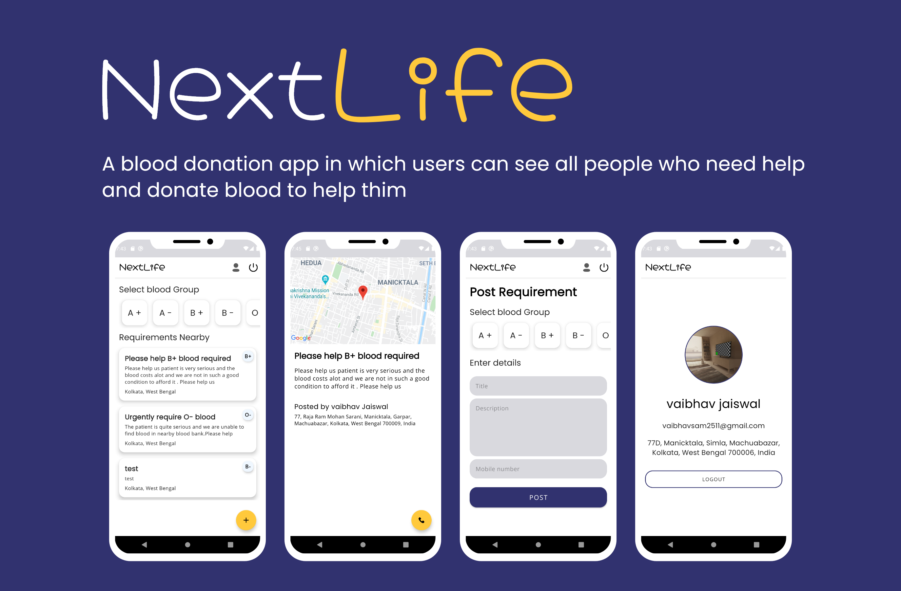
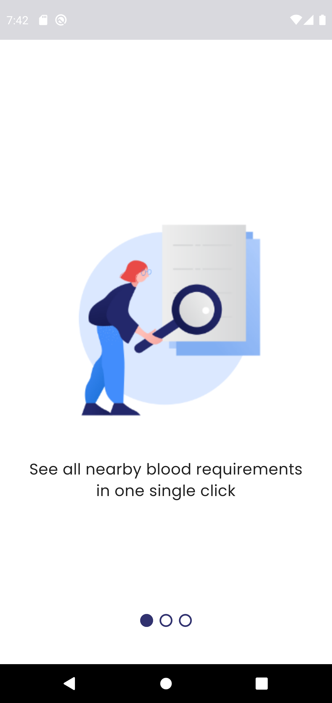
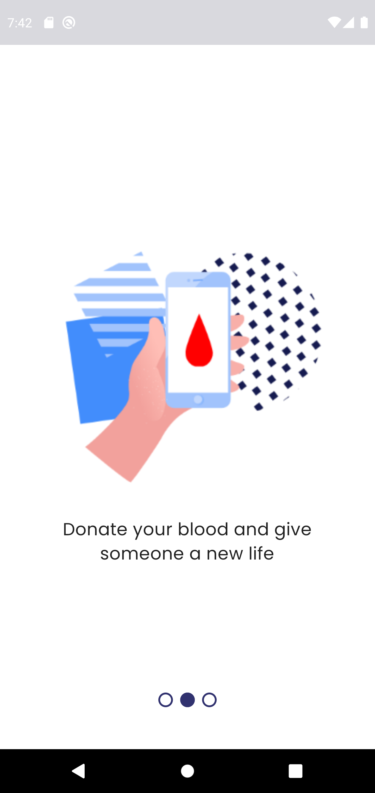
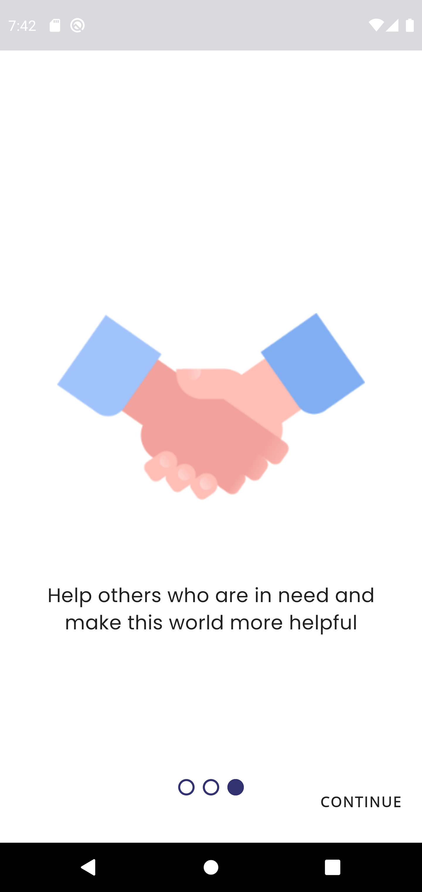
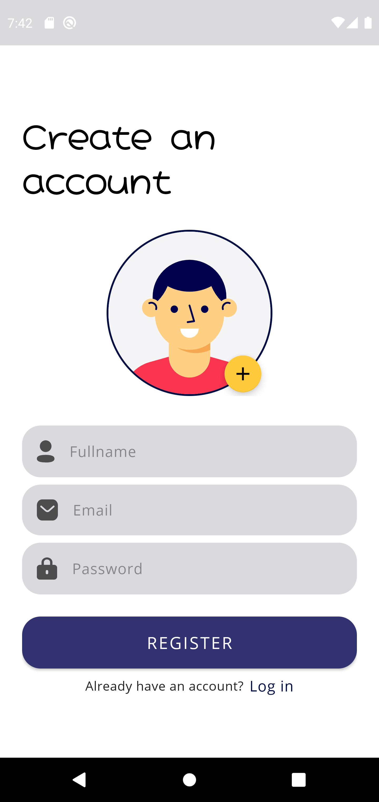
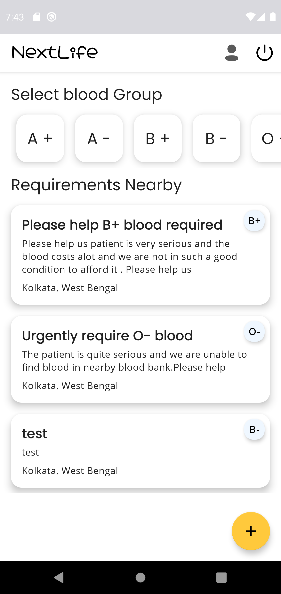
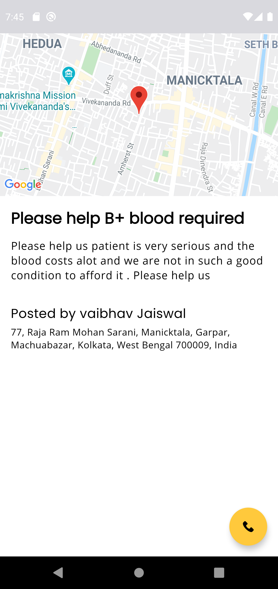
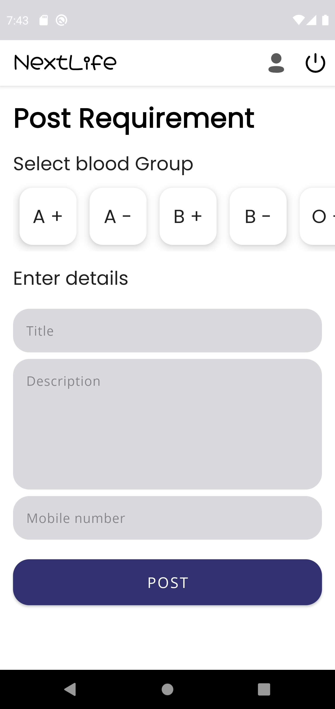
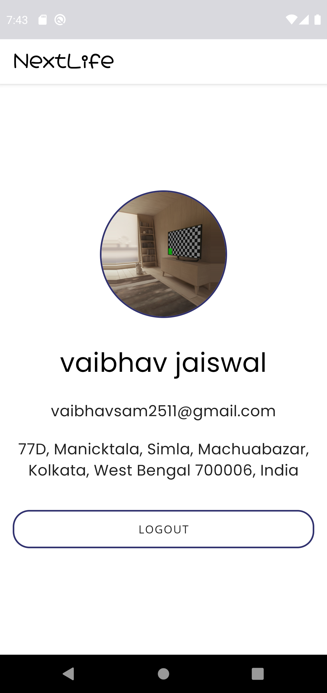

# **NextLife** 

**NextLife** is a blood donation app in which users can see all people who need blood in their city and can help them by donation their blood for a good cause. This app is made for [IGNITE 3.0 hackathon](https://nmignite.tech) .This app demonstrates use of *Modern Android development* tools.

***You can Install and test latest NextLife app from below 👇***

## Setup
Clone the repository on your machine. Open the project on your IDE and connect it to firebase , enable email based authentication , enable firestore and also connect [Google maps SDK](https://developers.google.com/maps/documentation/android-sdk/start) and then everything will be setup

## About

 It uses firebase as its backend. It uses Firestore which is a NoSQL database to store all data. Firebase Storage to store images and Firebase Auth for the authentication. It uses Google maps SDK to render maps in app

- Fully functionable. 
- Clean and Simple Material UI.
  

## 📸 Screenshots

||||
|:----------------------------------------:|:-----------------------------------------:|:-----------------------------------------: |
|  |  |  |
|  |  |  |
|  |  |  |

## Built With 🛠
- [Kotlin](https://kotlinlang.org/) - First class and official programming language for Android development.
- [Coroutines](https://kotlinlang.org/docs/reference/coroutines-overview.html) - For asynchronous and more..
- [Flow](https://kotlin.github.io/kotlinx.coroutines/kotlinx-coroutines-core/kotlinx.coroutines.flow/-flow/) - A cold asynchronous data stream that sequentially emits values and completes normally or with an exception.
- [Android Architecture Components](https://developer.android.com/topic/libraries/architecture) - Collection of libraries that help you design robust, testable, and maintainable apps.
  - [LiveData](https://developer.android.com/topic/libraries/architecture/livedata) - Data objects that notify views when the underlying database changes.
  - [ViewModel](https://developer.android.com/topic/libraries/architecture/viewmodel) - Stores UI-related data that isn't destroyed on UI changes. 
  - [ViewBinding](https://developer.android.com/topic/libraries/view-binding) - Generates a binding class for each XML layout file present in that module and allows you to more easily write code that interacts with views.
  - [DataBinding](https://developer.android.com/topic/libraries/data-binding) - Binds data directly into XML layouts
- [Dependency Injection](https://developer.android.com/training/dependency-injection) - 
  - [Hilt-Dagger](https://dagger.dev/hilt/) - Standard library to incorporate Dagger dependency injection into an Android application.
  - [Hilt-ViewModel](https://developer.android.com/training/dependency-injection/hilt-jetpack) - DI for injecting `ViewModel`.
- [Backend](https://firebase.google.com) - Google Firebase
  - Firebase Auth - To support email based authentication
  - Firebase Firestore - A NoSQL database to store all data 
  - Firebase Storage - A clous storage to store all images
- [Google Maps](https://developers.google.com/maps/documentation) - To render google maps in app
- [Timber](https://github.com/JakeWharton/timber) - A simple logging library for android.
- [Glide](https://github.com/bumptech/glide) - An image loading library for Android backed by Kotlin Coroutines.
- [Material Components for Android](https://github.com/material-components/material-components-android) - Modular and customizable Material Design UI components for Android.

# Package Structure
    
    com.vaibhav.sociofy    # Root Package
    .
    ├── data                # For data handling.
    │   ├── model           # Model data classes 
    │   └── repository      # Single source of data.
    |
    ├── di                  # Dependency Injection             
    │   └── module          # DI Modules
    |
    ├── ui                  # UI/View layer
    │   ├── auth            # Authorization Activity and its fragments
    │   ├── homescreen      # Home Activity and its fragments
    |   ├── onboarding      # Onboarding Activity and its files
    │   └── splashScreen    # SplashScreen Activity
    |
    └── utils               # Utility Classes / Kotlin extensions

## Architecture
This app uses [***MVVM (Model View View-Model)***](https://developer.android.com/jetpack/docs/guide#recommended-app-arch) architecture.

  
 ## Contact
If you need any help, you can connect with me.

Visit:- [VaibhavJaiswal.io](https://vaibhav2002.github.io)
  

